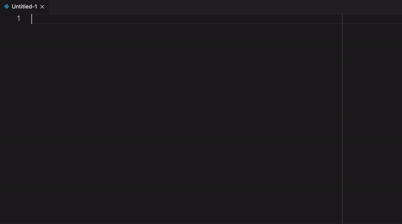

# MNE-Python for VS Code

A collection of some basic commands and code snippets for MNE-Python.



## Usage

### View a raw FIFF file in MNE-Python

Navigate to the file you wish to open in the file explorer pane, right-click
on the file to bring up the context menu, and select `View in MNE-Python`.

### Display MNE-Python version and system info

Open the command palette (⇧⌘P on macOS) and select the respective option.

### Code Snippets

Simply type

```python
import mne
```

while in Python language mode and select the desired snippet from the
IntelliSense proposals.

## Known Issues

None so far.
